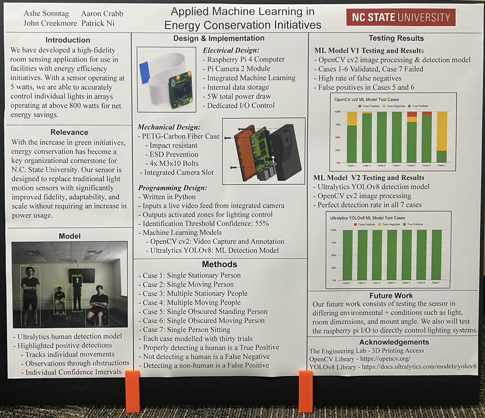

# [2025 FEDD Project - Smart Sensing]



A smart vision-based solution for detecting room activity and controlling lighting automatically.

---

## 📦 Software Requirements

Install the required dependencies using pip:

```bash
pip install opencv-python
pip install ultralytics
```

---

## 🛠️ Setup Requirements for Product

- One Monitor  
- A Keyboard  
- A Mouse  

---

## ⚙️ Software Setup for Product

1. Mount the physical product at the top of the back wall, ensuring the camera has a clear view of the full room.
2. Set `SHOW_STATIONARY_BOXES = True` and `SHOW_FLOOR_ZONE_BOXES = True`.
3. Define your `Floor_Zones` based on the coordinates of the stationary boxes.
4. Once floor zones are confirmed, set `SHOW_STATIONARY_BOXES = False`.
5. Check the placement of your floor zones and adjust coordinates as needed.
6. Implement code to link each zone’s ON/OFF status to your designated lights.
7. Consider adding a timer to keep lights on for a fixed duration (this may be included in a future version).
8. Once configured, you can **Set and Forget**.

---

## 🔩 Requirements to Create the Physical Product

To replicate the hardware:

1. A Raspberry Pi (we used a Raspberry Pi 4).
2. Raspberry Pi Camera Module 2.
3. Access to a 3D printer to print a shell/enclosure for the Pi and Camera.
4. Any necessary hardware components for controlling your lights (relays, smart plugs, etc.).

---

## 💡 Why Use This Product?

- Automatically detects presence and activity zones in a room.
- Helps reduce unnecessary energy usage by activating lights only when needed.
- Fully customizable zones and logic.
- Easily integrable with smart home systems.
- Set it up once, and it runs autonomously.

---

## 🖼️ Adding an Image

To display an image at the top of this README:
1. Place the image in your repository (e.g., in an `assets/` folder).
2. Replace the placeholder path above (`path/to/your/image.png`) with the correct relative path or a direct image URL.

---

## 📌 Note

This project uses [Ultralytics YOLO](https://github.com/ultralytics/ultralytics), which is licensed under **AGPL-3.0**. Be sure to comply with the terms if you plan to host, distribute, or commercialize a modified version of this product.
